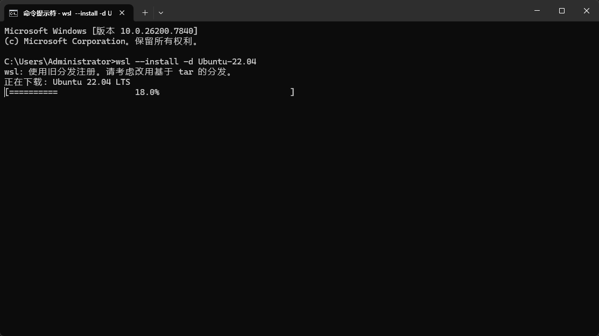
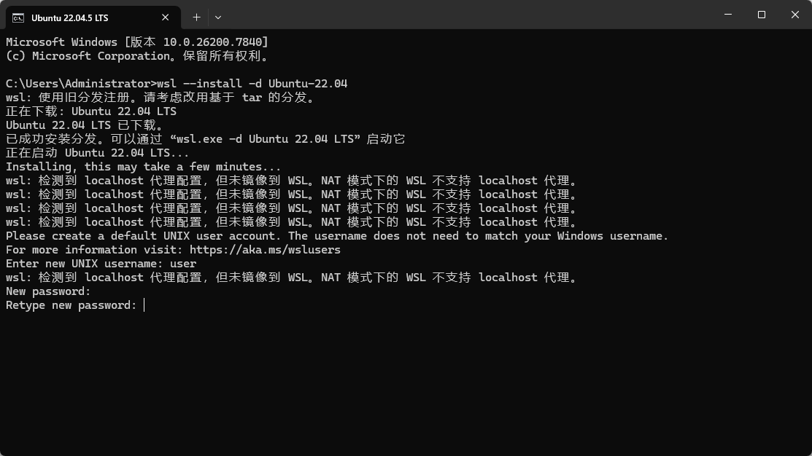
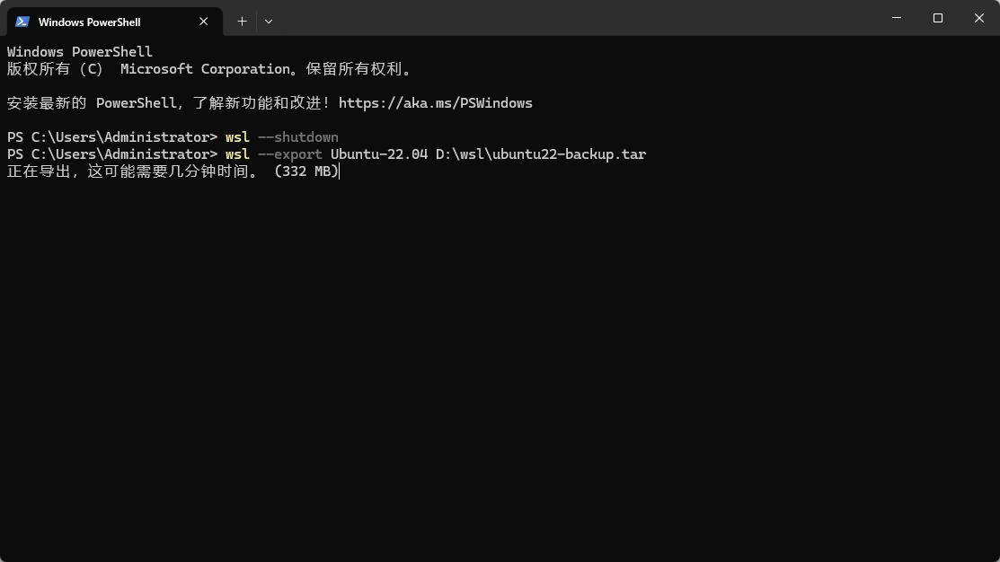
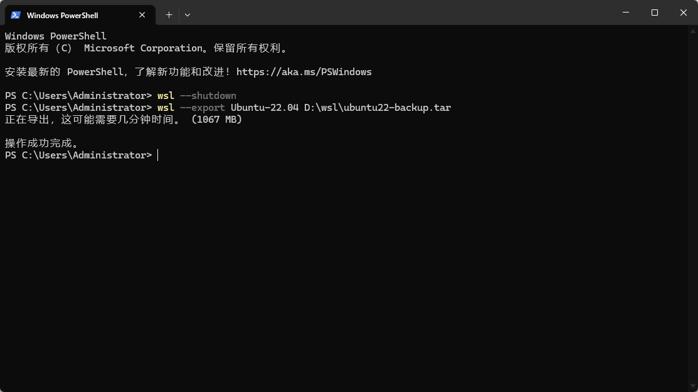
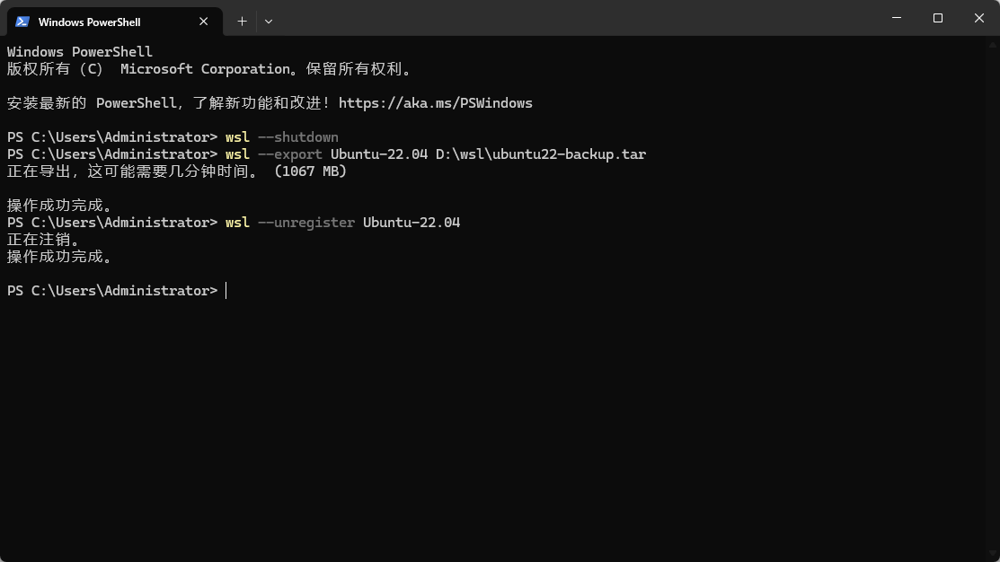
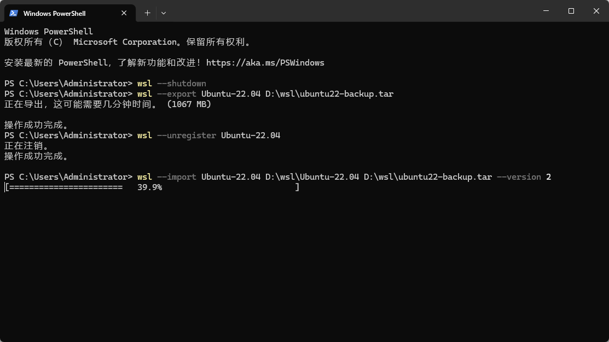
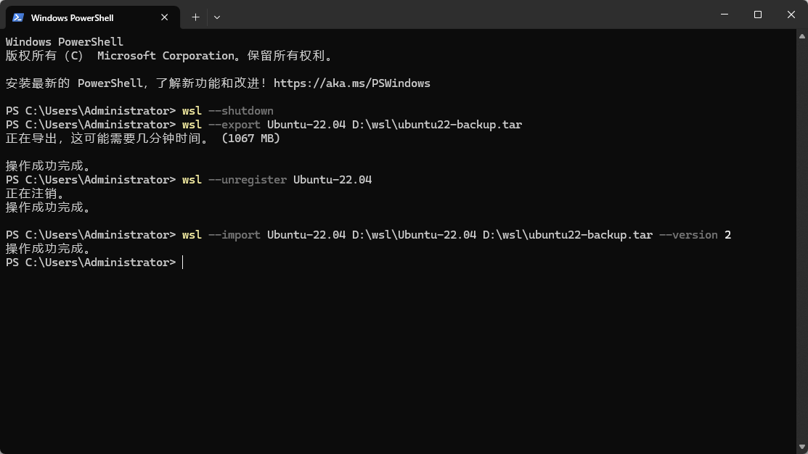

# WSL2安装教程（Ubuntu22.04）

## 🧪虚拟环境配置
该方法面向引导Windows用户安装WLS2+指定发行版，这里以Ubuntu22.04安装为例
## 📦发行版安装
下列安装要求运行 Windows 10 版本（内部版本 19041 及更高版本）或 Windows 11 

以管理员身份运行 cmd 或PowerShell，安装目标镜像
```
# ubuntu22.04 示例
wsl --install -d Ubuntu-22.04 
```





安装完成后会提示创建UNIX用户名和密码，按提示创建即可
## 🔄发行版迁移（推荐）
1. 迁移镜像至其他盘
WSL2默认安装镜像至C盘，后续开发还需要占用C盘内的存储空间，建议将镜像迁移出C盘
```
# 关闭正在运行的 WSL
wsl --shutdown 
```
2. 导出镜像为.tar后缀文件，这里以D盘为例
```
# ubuntu22.04 示例
wsl --export Ubuntu-22.04 D:\wsl\ubuntu22-backup.tar
```





3. 注销初始安装（这一步会删除C盘上的数据，确保上一步已经执行，即镜像已经导出）
```
# ubuntu22.04 示例
wsl --unregister Ubuntu-22.04 
```



4. 创建迁移路径并导入
```
# ubuntu22.04 示例
mkdir D:\wsl\Ubuntu22 # 创建<导入目录>
wsl --import Ubuntu-22.04 D:\wsl\Ubuntu-22.04 D:\wsl\ubuntu22-backup.tar --version 2
```





5. 设置默认登录用户
重新导入后默认以root用户登录，恢复原设置用户，高亮表示在WSL2中执行
```
# 启动默认WSL2
wsl

# 在WSL内部执行，适用于所有发行版
echo -e "[user]\ndefault=<默认用户名>" | sudo tee -a /etc/wsl.conf

# 从WSL内部退出后执行关闭程序，再次进入时生效
wsl --shutdown

# 在WSL内部执行，如果不小心输错了配置，按下面代码清空配置，再重新按上面步骤操作即可
sudo truncate -s 0 /etc/wsl.conf
```
`<默认用户名>`填写第2步中安装完成后创建的用户名

退出WSL2:
>关闭当前 WSL 终端窗口，回到 Windows 终端 / PowerShell 界面

`exit` 或者 点击WSL终端右上角的×关闭按钮 或者 快捷键`ctrl+d`

6. 验证迁移成功
通过查看vhdx文件位置确定虚拟环境的磁盘写入位置
```
# 在 PowerShell 中查看虚拟磁盘文件所在位置 
(Get-ChildItem -Path "D:\wsl" -Recurse -Filter "*.vhdx").FullName  
```
如果返回有路径结果，则说明虚拟磁盘文件保存在到返回路径下所在的磁盘空间当中