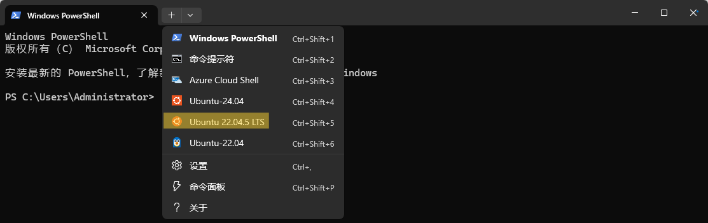
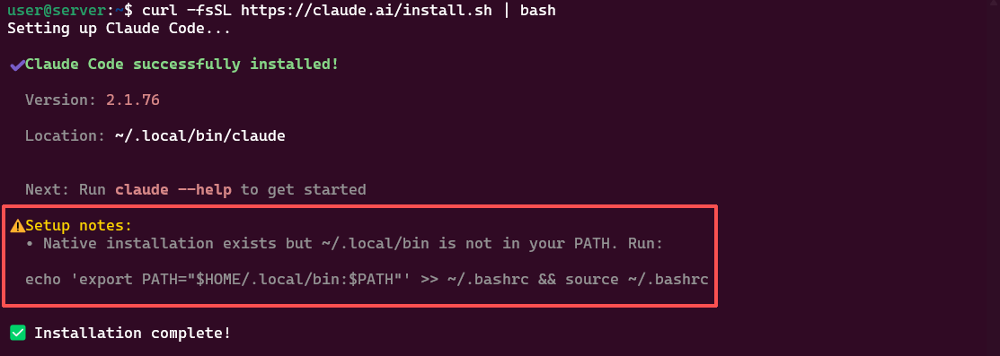
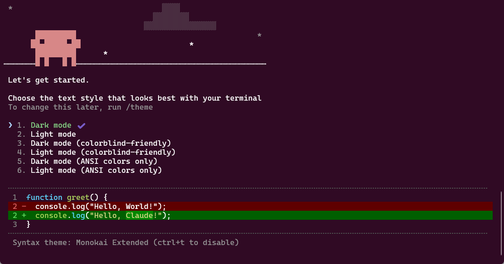
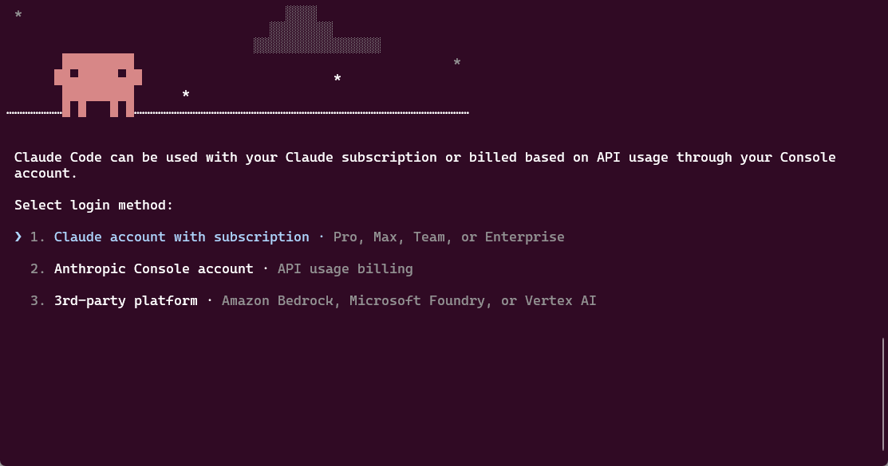
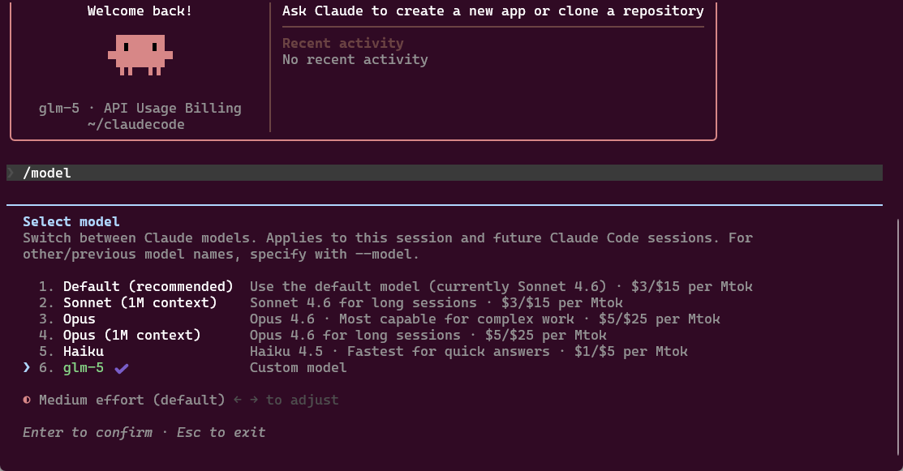
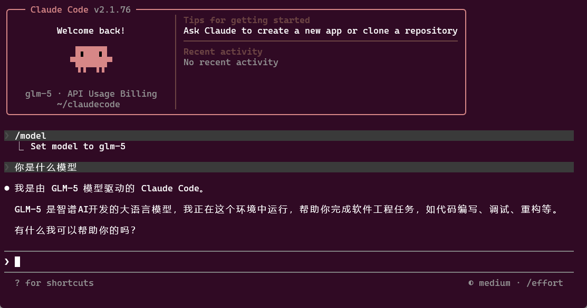

# Claude Code 安装与配置
## 🧰工具安装
### 🐧启动WSL2
键盘快捷键: `Win+R`，输入 `cmd` 或 `powershell` 打开终端，点击上方+号，进入指定发行版环境



### 🤖安装Claude Code
```
# Linux/WSL/Macos 安装Claude Code命令行
curl -fsSL https://claude.ai/install.sh | bash 
```



弹出的注意事项（Setup notes）：

旨在把cc的可执行文件路径加入环境变量，后续终端任意位置输入 claude 系统能找到并运行
```
# 添加cc可执行文件路径至系统环境变量
echo 'export PATH="$HOME/.local/bin:$PATH"' >> ~/.bashrc && source ~/.bashrc
```
复制指令到命令行并 `enter` 运行即可

### ⏸️运行Claude Code
```
# 启动Claude Code CLI工具
claude
```



根据个人喜好选择主题模式，后续可使用 `/theme` 指令修改，`enter` 进入下一步



Claude官网订阅用户可以采用选项1: Claude account with subscription来进行登入
反之个人开发者推荐选项2: Anthropic Console account使用API登入，好处是能够灵活体验不同大模型公司提供的调用服务。换言之使用cc作为完整的Agent框架+接入其他大模型公司API交互

## 📊案例展示
这里以GLM-5模型为例，在完成配置后选择一个任意工作目录激活cc

每进入一个新的工作空间cc需要你enter确认是否信任该文件夹，默认回车即可
```
/model #切换不同的模型
```



可以看到cc的登入模式直接默认为API Usage Billing，且选择了glm-5模型

