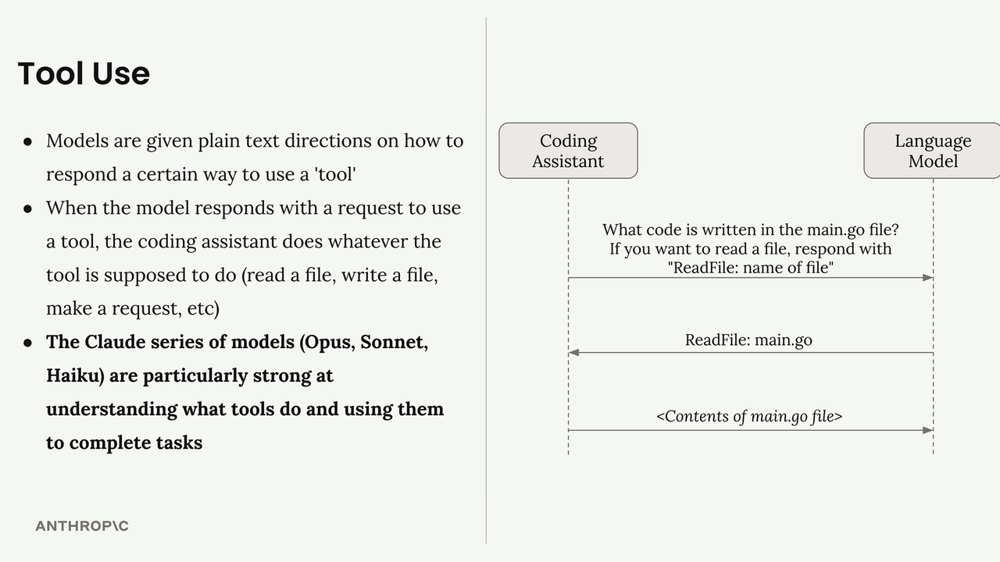

# 什么是编程助手？

>很多人误解Claude Code以及Codex等产品只是一个会写代码的聊天机器人，但实际上远不止如此,
>它更是一个借助大语言模型调用指定工具来完成并处理任意场景复杂任务的逻辑系统。
>这一本质降低了使用门槛，让任何不需要掌握代码能力的用户，也能够借助语言交互实现你的目标，帮助你完成一些重复性的劳作，提高你的效率腾出更多的时间！
>了解其工作原理，可以更好地帮助你在日常工作或者生活当中灵活使用它！

那么在开始之前我们首先要对一些概念进行充分的了解~

## 什么是大语言模型？什么是提示词？什么是上下文窗口？
***大语言模型(Large Language Model, LLM)***：

- 概括理解为逐词预测模型，由于海量互联网知识训练，根据你所提供内容的提供最高相关度回复
这就是为什么大模型产品在会话窗下面加上AI生成谨慎甄别的字眼，是由于LLM只是做你提供的内容的预测，而预测是否真实还需要靠人类来判断。

***提示词(Prompt)*** ：

- 用户提供给大语言模型的输入指令，你描述得越清楚，AI越能给你提供你想要的回答
就是我们在键盘上敲下的那些和LLM交互的文字，一个模棱两可的提问会换来模棱两可的回答，而一个清晰通顺的提问将会换来你最想要的回应，极大提高交互效率。提示词也是一门学问，后面会出一个帖子单独讲:)

***上下文窗口(Context Window)*** ：

- 由于大语言模型一次能够加载提示词内容是有限的，像人类短期记忆，超过范围就会忘记之前的内容
其实你的每次交互LLM并不是重新开始会话，而是将你每一次的提示词还有LLM的回答都一起保存下来，当你提供新的提示词时，历史提示词+当前提示词给到LLM，LLM再根据这些内容继续回复，以此类推。

## 为什么编程助手能够起作用

当你把一个任务交给编程助手，比如"帮我找找这个报错是哪里出了问题"，它不会随口乱说，而是会像一个有经验的程序员那样，有条不紊地处理

1. 先搞清楚情况 — 这个报错出在哪个文件？跟哪些代码有关？
2. 想好怎么解决 — 是要改某段代码，还是需要重新跑一次测试来验证？
3. 动手去做 — 真的去修改文件，执行命令，把事情做完。

你看，第一步和第三步都需要它真正地"接触外部世界"——读取文件、运行命令、修改代码。

## 为什么调用工具如此重要？

由于大语言模型质上只能做一件事：接收文字，输出文字。但是为什么编程工具能够实现这些任务呢？

>例如你直接向一个语言模型提出：“帮我处理某个Excel文件里面的数据”，它只会告诉你我没有读取文件的能力。

那么这些编程助手是如何解决这个问题的呢，答案是：调用外部工具

但当你向编程助手提问“帮我处理某个Excel文件里面的数据”时，实际发生的情况是：

1. 编程助手会加工你的问题附上一段说明，指引大语言模型去输出调用工具的指令
>例如："如果你想读文件，就回复我 ReadFile:<文件名>.xlsx "
2. 语言模型收到后，回复："ReadFile: <文件名>.xlsx"
3. 编程助手看到这个指令，调用对应的阅读工具读取该文件信息
4. 将文件内容返回给语言模型，那么这个时候语言模型就真正“看见”信息
5. 语言模型再根据文件内容，给你一个真正有用的回答

你和 AI 之间看似简单的一问一答，背后其实经历了一套完整的"请求 → 行动 → 反馈"流程。