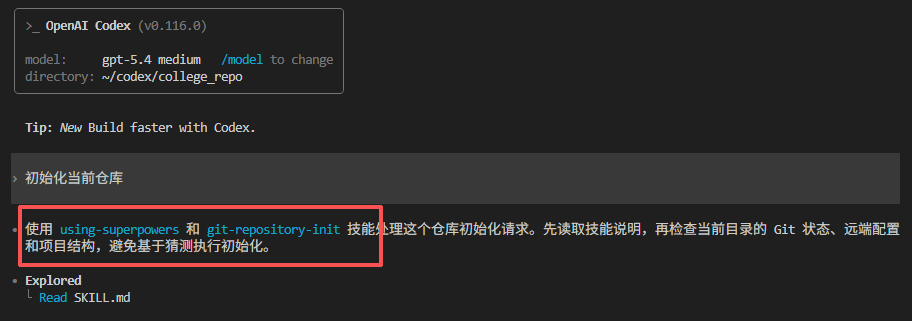
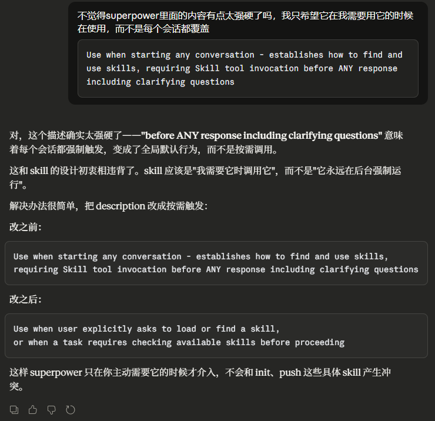

# Skill 也会“污染”其他 Skill ？

最近我遇到一个很典型、但又很容易被忽略的坑：

我通过 Codex 完成功能开发后想把项目 push 到远程 git 仓库，为了自动化这个推送流程我专门写了一个 Skill 来完成。但是当我在会话中表示“帮我推送代码到远程仓库”，甚至是单独指定使用我的 Skill 时，**安装其他的 Skill 也同样触发干扰了我的 Skill 操作**。

一开始以为是自己写的 Skill 描述不够准确。后来排查了一圈才发现，问题不一定出在你自己写得差，而是安装的其他 Skill 本身就带着很强的全局触发倾向。一旦被配置，就不只是“给你多一个能力”，而是在某些场景下直接参与会话控制，甚至干扰其他 Skill 的正常使用。


## 先说清楚，Skill 到底是什么

Skill 可以简单理解成一个“带触发条件”的可复用能力说明书。

当你遇到需要重复执行的任务流时，就可以将整个流程写成一个 `SKILL.md` ，然后让 Agent 根据这个 Skill 中的描述和用户的会话需求是否接近来决定是否触发该 Skill，触发后根据 `SKILL.md` 中规定的工作流程来处理用户任务，显著提高工作效率。

一个标准的`SKILL.md`结构如下:
```
---
name: my-skill
description: What this skill does
disable-model-invocation: true
allowed-tools: Read, Grep
---

Your skill instructions here...
```
其中包含的主要内容有：
- `name`：这个 Skill 叫什么
- `description`：什么情况下应该触发它
- 正文规则：触发后具体执行哪些内容，又有哪些需要注意的事项

很多人在认识一个新 Skill 时会更关注正文规则部分，即这个Skill到底能完成一个什么样的任务。但实际上 `description` 才是入场券。因为 Agent 往往会先根据描述，判断是否激活该 Skill 执行当前任务。


## 事情的起因：使用自建 Skill 时其他 Skill 意外介入
我自建一个 Skill 来帮助我初始化项目随后进行代码的远程推送，我定义了两个功能分别是初始化 `git-repository-init` 和推送 `git-repository-push`，其中一个初始化 Skill 中的定义是：
```js
---
name: git-repository-init
description: Initialize a local git repository and connect it to a 
remote repository.
---
```
该 Skill 的作用是完成 git 的远程仓库 URL 配置，这样后续推送时能够直接连到远程仓库。具体的执行流程的前几步是：
1. 检查当前目录是否已经是 Git 仓库，如果是停止后续操作
2. 初始化本地仓库
3. 设置默认分支为 main
4. 检查是否存在 .gitignore 文件
5. 检查是否已经配置远程仓库URL


按我的预期，后面只要我在会话中表示：
- 初始化当前项目
- 使用 git-repository-init Skill初始化当前项目

这类请求都会使 Agent 根据我的请求进入我自己的 Skill 流程。



但实时并非如此，可以会话中看到，同时检测到 `using-superpowers` 和我的 `git-repository-init` Skill。`using-superpowers` 是作为 `superpowers` 体系里的一个引导型 Skill ，用于检查、加载和判断 Skill。

虽然最后依然根据我的 `git-repository-init` 完成了这项任务，但这其中存在有两个明显的副作用：
- 额外的 Skill 内容给我设计的 Skill 流程添加了许多额外的执行步骤
- 同时激活 Skill 时该`SKILL.md`内容也加入到输入提示词当中，导致非必要的token数量激增


## 我是怎么排查到问题根源的

一开始怀疑是 Skill 的`description`不够具体，在AI的推荐下直接声明排他性即如果其他skill参与进来则立马忽视，但修改了多遍描述依然无效。

后来我去翻 `using-superpowers` 中的描述，发现它是这样定义的:
```js
---
name: using-superpowers
description: Use when starting any conversation - establishes how to
find and use skills, requiring Skill tool invocation before ANY 
response including clarifying questions
---
```
这个描述的意思是在每个会话都强制触发，变成了全局默认行为，而不是根据需求来调用。而后我在 `Claude` 官网进行了提问：



最后按照官网的结果对`using-superpowers` 里面的描述进行修改，顺利解决了这一问题

## 几个总结下来的避坑建议

如果你也准备使用 Skill，或者开始自己写 Skill，我建议先记住这几条：

**第一，下载完 Skill 后，先浏览它的 `description` 内容**

> 如果描述里有特别强的全局语义，那你就要警惕它是不是会干扰别的 Skill。

**第二，不要迷信“我说了需求，模型自然会选对 Skill”**

> Agent 是根据会话内容与 Skill 的描述是否相似来决定触发
如果描述过于宽泛可能不会激活

**第三，当你明确需要执行某个 Skill 时，最好还是显式用 `$` 符号指定**

> 别完全依赖自然语言去“暗示”模型
直接指明使用哪个Skill，至少能显著减少非必要的token消耗
