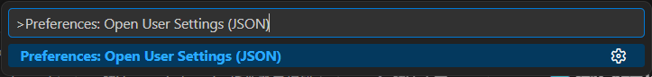
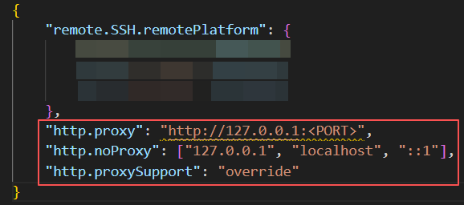
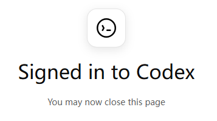

# 解决VScode上Codex插件登录报错
使用 VScode 远程 ssh 服务器并配置 Codex 插件登录时遇到报错：
```js
Error code token_exchange_failed Details Token exchange failed: 
token endpoint returned status 403 Forbidden
```
尝试过在 `~/.ssh/config` 中设置 `RemoteForward` 参数无效，最后在 VScode 的 `settings.json` 显式设置代理端口覆盖完成

亲测如需在本地 VScode 登录 Codex 插件完成 `settings.json` 设置即可；如需远程在 ssh 配置文件里面完成 `RemoteForward` 参数设置即可

## 💻测试环境
- 宿主端：`Windows 11` -> 远程端：`Ubuntu 20.04`
- VS Code：`1.96.4`（exe）
- 代理端口：`127.0.0.1:<PORT>`

代理端口的`<PORT>`可以在代理软件的 设置 -> 端口设置 处查看
>*温馨提示：VScode 在 `1.99` 版本后不支持在 `Ubuntu 20.04` 以下版本的使用 `Remote-SSH` 插件进行连接，如果想使用 ssh 远程连接 `Ubuntu 18.04` 需要降低宿主端安装的 VScode 版本, 亲测 `1.96.4` 版本有效*

## 🔨解决方案
 **`<XXX>`仅作为占位符参数用来引导，使用时需要根据具体情况进行替换**
### 0. 配置远程连接
步骤跟随下图红字顺序： 
VScode `Remote-SSH` 插件 -> 点击 `⚙` 图标 -> 选择用户目录下配置文件


在打开的文件中配置远程信息并加上 `RemoteForward` 参数
```js
Host <自定义备注名称>
    HostName <服务器IP地址>
    User <登录账户名>
    Port <入口端口>
    RemoteForward <PORT> 127.0.0.1:<PORT>
```
记得更换占位符参数，此处提供一个示例

```js
Host myserver
    HostName 192.168.xx.xx
    User user
    Port 22
    RemoteForward 7897 127.0.0.1:7897
```

关键参数含义：
- `Port` 👉 一般默认为22，如果修改过服务器的SSH开放端口则需要在此替换
- `RemoteForward` 👉 使远程的联网请求都走本地代理进行处理

### 1. 配置VScode代理

在VScode内通过快捷键 `Ctrl + Shift + P` 打开命令面板， 输入并选择 `Preferences: Open User Settings (JSON) `



在打开的`settings.json`文件末尾处补充以下配置
```js
"http.proxy": "http://127.0.0.1:<PORT>",
"http.noProxy": ["127.0.0.1", "localhost", "::1"],
"http.proxySupport": "override"
```
记得更换`<PORT>`处为对应宿主端代理端口



补充配置键值对含义：
- `http.proxy` 👉 指定 VSCode 内所有联网请求都走指定代理
- `http.noProxy` 👉 当 VScode 访问自己电脑地址时不走代理
- `http.proxySupport` 👉 强制使用当前文件的代理设置规则

### 3. 重启并登录
关闭VScode后再次开启，激活 Codex 插件并执行登录流程

希望大家都能如愿


