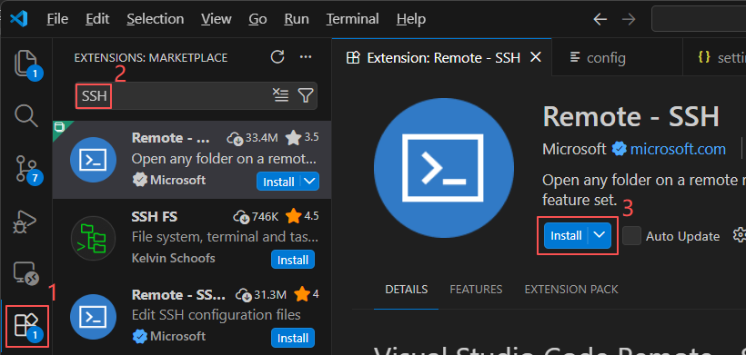
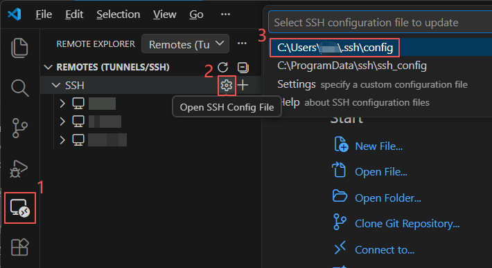
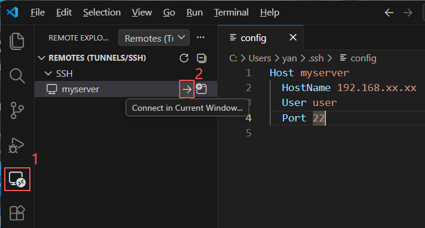

# 实现VScode远程SSH连接服务器
一个在 VScode 中使用 `Remote-SSH` 扩展连接远程服务器的详细教程

## 📦 前提条件

- 本地端已安装 **VS Code**
- 本地端能通过 SSH 命令成功连接到远程端

**如何测试 SSH 是否能连通**

在你本地电脑的终端输入下面命令 (账户名和IP查看在后面介绍)：

```js
ssh <远程端账户名>@<远程端IP>
```
- 第一次连接时通常会提示 `Are you sure you want to continue connecting (yes/no)？`，输入 yes 回车即可
- 按系统提示输入密码，随后命令提示符更新（例如`<远程端账户名>@xxx:~$`）说明连接成功

***SSH 支持跨平台使用***：

只要你的本地电脑（宿主端）能安装 VSCode，并且能通过如下 SSH 命令连上远程服务器，基本就能用 VSCode 的 `Remote-SSH` 插件功能。

>新版本 VScode 对部分旧版本 OS 不再提供 SSH 服务，可降低 VScode 版本

## ⚙️ 如何实现
以 `Windows` 宿主端连接 `Ubuntu 20.04` 远程端为例,
事先安装好 VScode：`1.96.4`（exe）
### 0. 安装 SSH 插件
步骤跟随下图红字顺序： VScode `Extensions` 商店 -> 搜索 `SSH` 关键字 -> 安装 `Remote-SSH` 插件



### 1. 配置远程连接
步骤跟随下图红字顺序： VScode `Remote-SSH` 插件 -> 点击 `⚙` 图标 -> 选择用户目录下配置文件



在跳出用户路径下的 `~/.ssh/config` 中配置 remote 服务器信息
```js
Host <自定义备注名称>
    HostName <服务器IP地址>
    User <登录账户名>
    Port <入口端口>
```

关键参数含义：
- `HostName` 👉 服务器IP地址，在不同服务器终端中输入对应命令行查看
- `User` 👉 服务器账户名，`Win/macOS/Linux`支持终端输入 `whoami` 查看
- `Port` 👉 一般默认为22，如果修改过服务器的SSH开放端口需要替换

**[重点防坑] 如何选择正确的服务器IP地址？**

***Windows*** 服务器终端输入：
```
ipconfig
```
- 找到 **以太网适配器 (有线连接)** / **无线局域网适配器 WLAN (WIFI连接)**
- 查看下面 IPv4 地址 —— 通常是 192.168.x.x 或 10.x.x.x 这类

***Linux / Macos*** 服务器终端输入：
```js
ip a
```
- 找到带有 **scope global** 关键字的那一行
- 例如：inet x.x.x.x /24 brd x.x.x.x scope global dynamic noprefixroute

均忽略 `127.0.0.1`，这是本机的回环地址，不能用于远程连接

### 2. 选择远程连接
步骤跟随下图红字顺序： VScode `Remote-SSH` 插件 -> 点击 `->` 图标



第一次进入时会让你选择操作系统以及提供账户密码，一一输入即可
随后左上菜单栏点击 `File` -> `Open Folder` 查看是否在远程端路径下

### **[可选]** 配置SSH密钥
上一步完成后其实就已经完成SSH连接所需要的所有配置，个人使用下来推荐再加上这一步互联主机的密钥配置，这样每次远程连接的时候就**不再需要输入密码！非常方便！**

详见主页另一篇笔记《🔑还在苦恼SSH手输密码？试试密钥大法！》