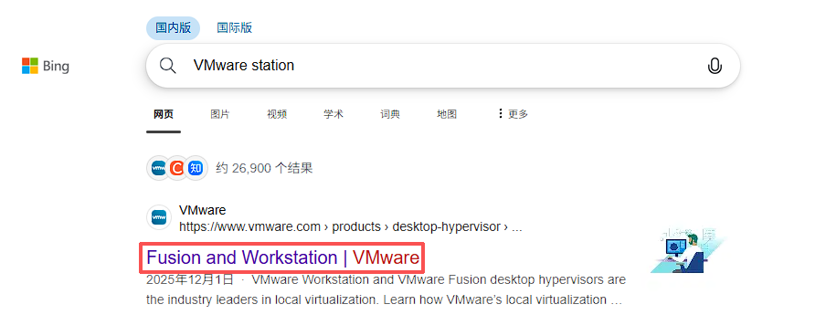
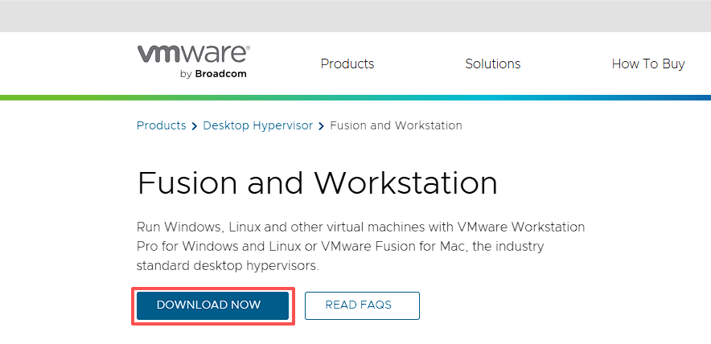
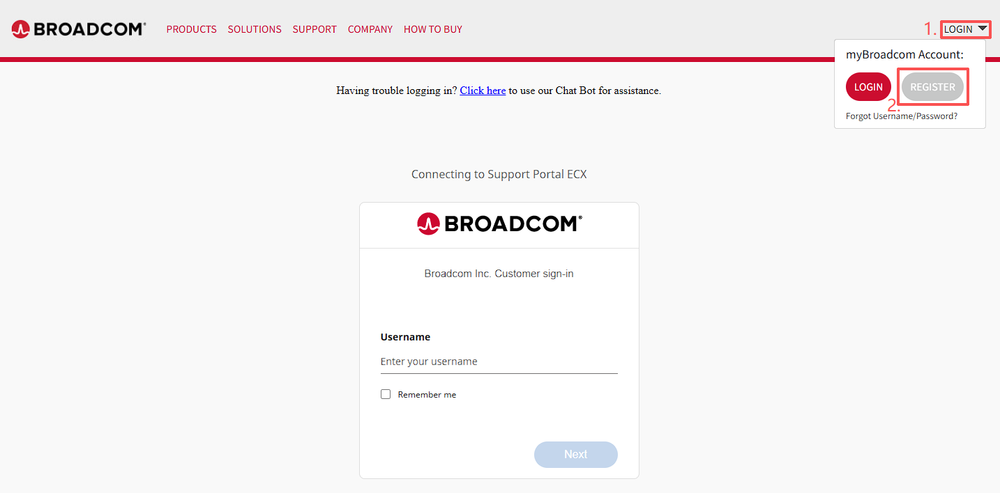
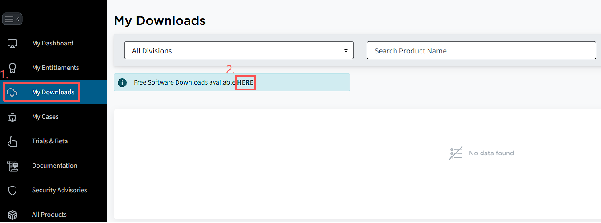
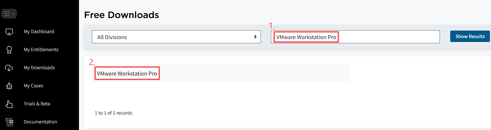
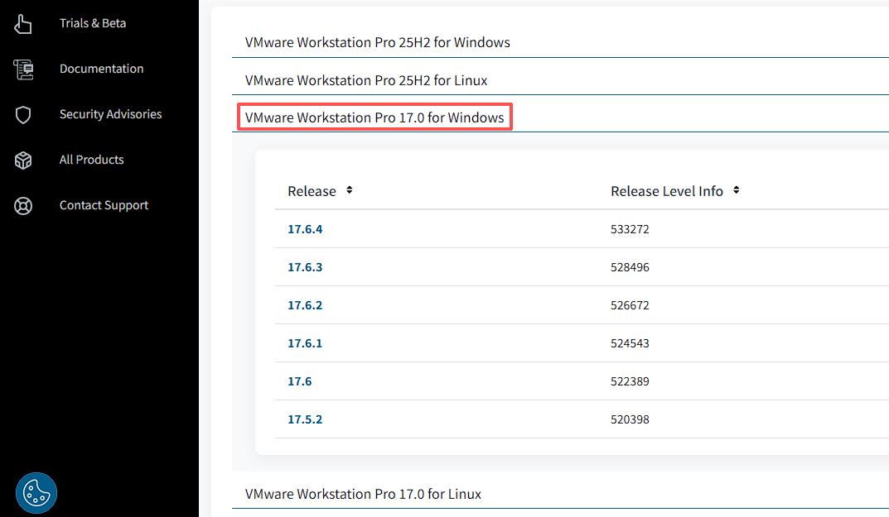
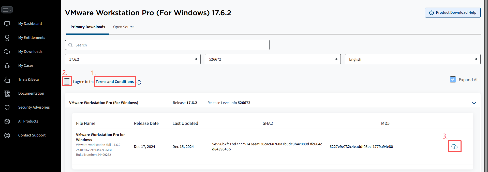
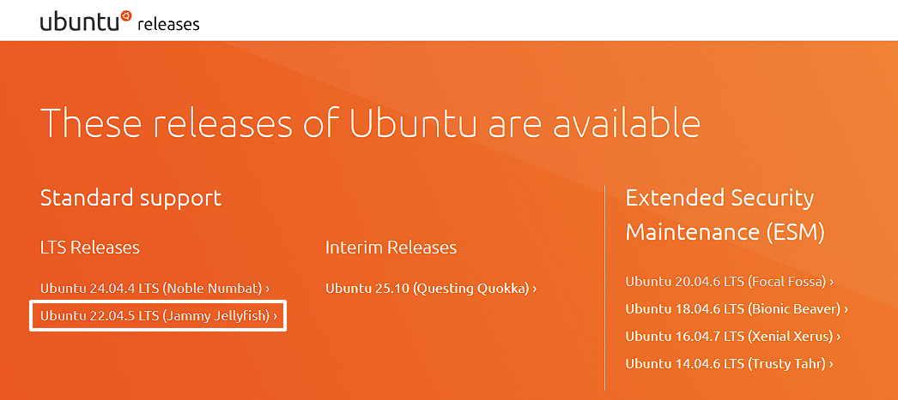
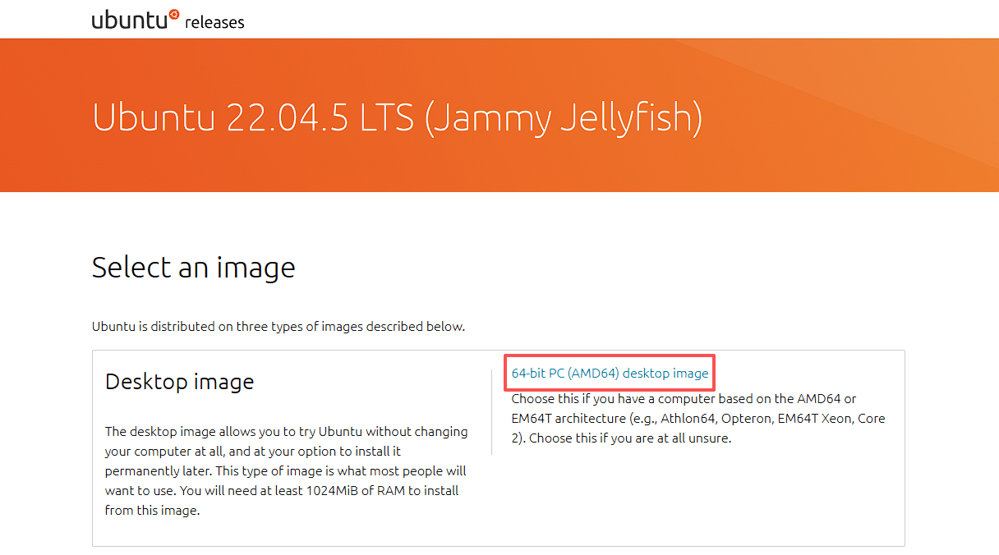

# VMware Station 虚拟机 + Ubuntu22.04 镜像配置（准备篇）
当前大多 AI 工具的部署对 Linux 操作系统更加友好，安装更快捷。许多原本 Windows 用户也逐渐开始接触 Linux 以及 WSL(Windows Subsystem for Linux)。但是对于在 Windows 下长年使用可视化界面进行系统操作的朋友而言，面对 WSL 这种纯命令行的终端模式实在头疼。

那么如何能在 Windows 电脑上完整运行带有图形界面的 Linux 系统？

针对这一问题分享一期关于 VMware 虚拟机 + Ubuntu 22.04 镜像配置，让纯小白也能够快速上手，在 Windows下体验完整图形化界面交互的 Linux 操作系统。

>由于篇幅有限这一期先做配置前的准备教程

## 开始前准备
- 电脑配置：至少 4GB 内存，20GB 空闲硬盘，关闭杀毒软件。

### 💻下载 VMware Station 虚拟机
浏览器搜索 `VMware Station`, 点击进入 `Fusion and Workstation`

选择 `DOWNLOAD NOW ` 跳转到 `BROADCOM` 登录界面

点击右上角 `LOGIN` 里的 `REGISTER`
> 网易或者扣扣邮箱在这里会失效，使用 outlook 邮箱进行注册

经过一系列邮箱验证，个人信息完善后，会跳回到最一开始的登录界面
> username 就是你刚注册的邮箱，填写设置的密码登录

跟随红字步骤点击进入 `Free Software`

搜索 `VMware Workstation Pro` 点击进入

选择 `for Windows` 版本下载，`25H2`代表25年下半年的新版本，`17.0`代表过去老版本，这里建议选 `17.0` 更稳定

一开始是不让下载的，需要查看条款。点击高亮 `Term and Conditions`

完成后回到下载页面勾选条款后开放下载

不过这里应该还有一些额外的档案信息需要填写，完成必填处的填写就可以下载啦

### 🐧下载 Ubuntu 22.04 镜像
浏览器输入 `Ubuntu` 发行版下载网址: `https://releases.ubuntu.com/`， 并点击进入 `Ubuntu 22.04.5 LTS (Jammy jellyfish)`
>这里以 22.04 版本作为示例，同理可以自由选择指定版本进行安装

在 `Desktop Image` 栏内的蓝色高亮处下载指定版本的 `.iso` 镜像文件

